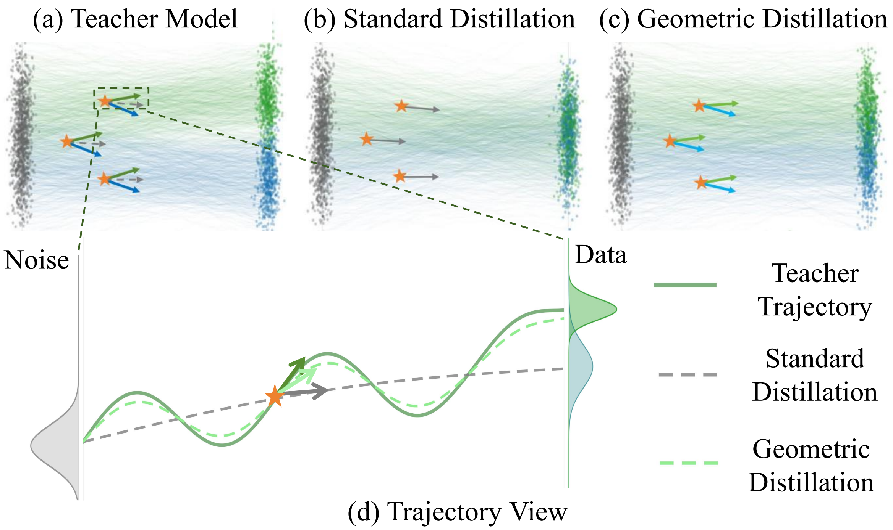
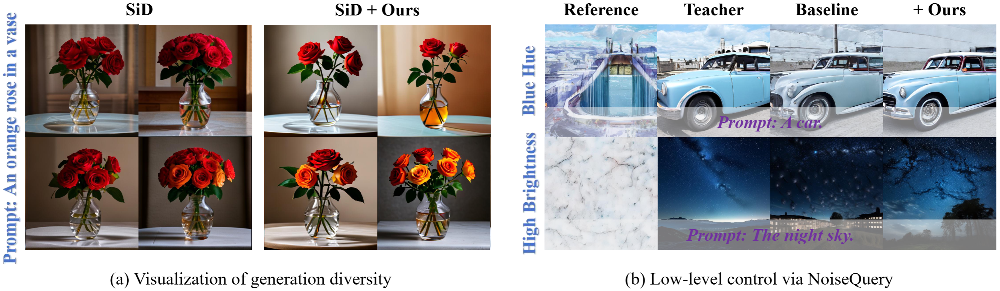

# Restoring Initial Noise Sensitivity in Text-to-Image Distillation via Geometric Alignment
This repository contains the official code for the ICML 2026 paper "Restoring Initial Noise Sensitivity in Text-to-Image Distillation via Geometric Alignment".

🚀 The training implementation and a reproducible PixArt example are available in this repository.

## 📖 Abstract
Generative distillation significantly accelerates text-to-image (T2I) generation by compressing multi-step trajectories into few-step student models while preserving perceptual quality. However, existing methods primarily optimize efficiency and output fidelity, often neglecting a critical property of the original trajectory: sensitivity to initial noise. The degradation of this sensitivity impairs downstream control methods relying on noise-based optimization and manipulation. 
In this work, we propose Geometry-Aware Distillation (GAD), a sensitivity-preserving framework that aligns the local functional behavior of teacher and student models. Specifically, GAD matches Jacobian-vector products (JVP) with respect to input noise, enabling the student to reproduce the teacher's differential response to perturbations. Extensive experiments across multiple T2I paradigms demonstrate that GAD significantly restores sensitivity and improves diversity while maintaining high visual fidelity.

<p align="center">
	

## 🌟 Key Features
- Model-Agnostic Regularizer: GAD serves as a plug-and-play regularization term that can be seamlessly integrated with existing distillation paradigms.
- Restored Noise Sensitivity: Effectively addresses the smoothing effect of standard pointwise alignment objectives, recovering the model's sensitivity to input noise.
- Enhanced Controllability: Achieves superior performance on downstream tasks dependent on initial noise manipulation, such as training-free layout control and generation diversity.

## 🚀 Getting Started

### Prerequisites

- A Diffusers-format [PixArt-XL-2-512x512](https://huggingface.co/PixArt-alpha/PixArt-XL-2-512x512) checkpoint. The default Hub ID is `PixArt-alpha/PixArt-XL-2-512x512`; pass a local directory with `--pretrained_model_name_or_path` to work offline.
- Prompt data at [JourneyDB/train/train_prompt.jsonl](https://github.com/JourneyDB/JourneyDB) (or another file supplied with `--train_prompt_file`). Training is image-free: only text prompts are required.
- The default validation prompt file is `coco_1k.csv`, which is included in this repository.

### Environment setup

Install the repository dependencies:

```bash
pip install torch torchvision

pip install -r requirements.txt
```


### Train GAD

The following single-GPU command is a runnable GAD training example. It uses the geometric-alignment loss (`--lambda_nsp` and `--nsp_epsilon`).

```bash

CUDA_VISIBLE_DEVICES=0 accelerate launch \
  --main_process_port 29500 \
  --num_processes=1 \
  --mixed_precision=fp16 \
  train_gad_distillation.py \
  --train_batch_size 16 \
  --gradient_accumulation_steps 1 \
  --gradient_checkpointing \
  --max_train_steps 10001 \
  --learning_rate 2e-5 \
  --max_grad_norm 1 \
  --cfg 4.5 \
  --total_steps 900 \
  --lr_scheduler cosine_with_restarts \
  --lr_warmup_steps 50 \
  --use_huber \
  --use_separate \
  --lambda_nsp 1.0 \
  --nsp_epsilon 1e-2 \
  --checkpointing_steps 250 \
  --checkpoints_total_limit 5 \
  --validation_epochs 50 \
  --validation_file coco_1k.csv \
  --train_prompt_file JourneyDB/train/train_prompt.jsonl \
  --report_to tensorboard \
  --output_dir outputs/gad_pixart
```

Pass `--compute_validation_metrics` to compute CLIPScore, PickScore, and LPIPS; this requires `pip install open-clip-torch lpips` and downloads the corresponding public metric models unless local paths are supplied. `bitsandbytes` is only required when enabling `--use_8bit_adam`; `wandb` is only required when logging to Weights & Biases.


## 📊 Results
By integrating GAD, distilled models naturally alleviate diversity degradation without compromising image fidelity. Our method provides a unified solution that reconciles the trade-off between inference speed and generative controllability, outperforming standard distillation baselines on noise-based control tasks.  

<p align="center">
	

## ✒️ Citation
If you find our work helpful for your research, please consider citing our paper:
```
@inproceedings{huang2026restoring,
  title={Restoring Initial Noise Sensitivity in Text-to-Image Distillation via Geometric Alignment},
  author={Huang, Huayang and Wang, Ruoyu and Zhao, Jinhui and Deng, Wei and Zhou, Daiguo and Luan, Jian and Wu, Yu and Zhu, Ye},
  booktitle={Proceedings of the 43rd International Conference on Machine Learning},
  year={2026},
  organization={PMLR}
}
```
